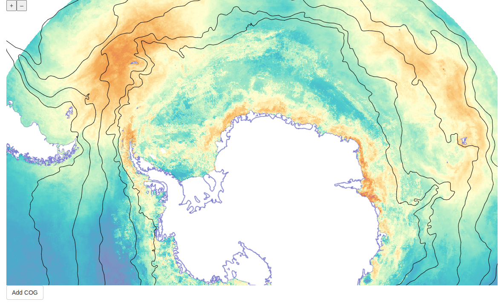

<!-- README.md is generated from README.Rmd. Please edit that file -->

```{r, include = FALSE}
knitr::opts_chunk$set(
  collapse = TRUE,
  comment = "#>",
  fig.path = "man/figures/README-",
  out.width = "100%"
)
```

# polr

<!-- badges: start -->
<!-- badges: end -->

The goal of polr is to provide bindings to the [OpenLayers](https://openlayers.org/) javascript library, with a focus on polar mapping applications.

## Installation

``` r
remotes::install_github("SCAR/polr")

```

## Example usage

### Shiny app

```{r example, eval = FALSE}
library(polr)
library(shiny)

ui <- fluidPage(
  polOutput("map", height = "80vh", width = "100%"),
  actionButton("cog", "Add COG")
)

server <- function(input, output, session) {
  output$map <- renderPol({
      polr::pol(view_options = list(extent = 6e6 * c(-1, -1, 1, 1))) %>%
          ## add a layer from a WMS server
          add_wms_tiles(url = "https://geos.polarview.aq/geoserver/wms",
                        layers = "polarview:coastS10") %>%
          ## add lines from a local file in flatgeobuf format
          add_fgb(file = system.file("extdata/fronts_park.fgb", package = "polr"),
                  style = list(`stroke-color` = "black"), zIndex = 99)
  })

  ## dynamically update the map
  prox <- pol_proxy("map")
  observeEvent(input$cog, {
      ## when the button is clicked, add a COG (cloud-optimised geotiff)
      prox %>% add_cog(
                   "https://data.source.coop/scar/distant/hindell_et_al-2020/Hi2023-aes_colony_weighted_cog.tif",
                   geotiff_source_options = list(interpolate = FALSE), opacity = 0.7,
                   style = list(color = pol_colormap(hcl.colors(21, "Spectral", rev = TRUE))))
  })
}

shinyApp(ui = ui, server = server)

```



### A stanadlone widget (e.g. for Rmarkdown)

```{r example2, eval = FALSE}
library(htmltools)
library(lorem)

## random text formatted as HTML for popups
px <- sapply(1:100, function(i) as.character(tags$div(tags$h1(ipsum_words(3)), ipsum_words(5))))

polr::pol(view_options = list(extent = 6e6 * c(-1, -1, 1, 1))) %>%
    ## background layer
    add_wmts_from_capabilities("https://services.arcgisonline.com/arcgis/rest/services/Polar/Antarctic_Imagery/MapServer/WMTS/1.0.0/WMTSCapabilities.xml",
                               layer = "Polar_Antarctic_Imagery", zIndex = -1) %>%
    ## WMS coastline layer in polar stereographic projection
    add_wms_tiles(url = "https://geos.polarview.aq/geoserver/wms", layers = "polarview:coastS10",
                  name = "Coastline") %>%
    ## local geojson lines file
    add_geojson(file = system.file("extdata/fronts_park.geojson", package = "polr"),
                style = pol_style(stroke = list(color = "green")), data_proj = "EPSG:4326",
                name = "Fronts") %>%
    ## markers, shown as clusters
    add_clustered_points(lon = (runif(100) - 0.5) * 360, lat = runif(100) * -40 - 40,
                         cluster_options = list(distance = 50),
                         cluster_style = pol_style(text = list(fill = list(color = "blue")),
                                                   circle = list(fill = list(color = "orange"))),
                         marker_style = pol_style(text = list(text = "\uf041",
                                                              font = "normal 18px FontAwesome",
                                                              fill = list(color = "#00f"))),
                         popup = px, name = "Markers") %>%
    ## add a legend that allows layers to be turned on and off
    add_layer_switcher()

```

## Projections

OpenLayers is quite forgiving when it comes to projections: layers will typically be reprojected automatically to the map projection. That means that you can add a layer in longitude-latitude coordinates to a polar-projected map, and the layer will be reprojected as required. However, be aware that you might still encounter issues:

- interpolation artifacts around the anti-meridian (e.g. when adding WMS tiles in long-lat coordinates)

- some functions also expect inputs to be in longitude and latitude (e.g. `add_points`)

- or encourage you to specify the projection (because it can't always automatically be deduced, e.g. `add_geojson`).


## Development notes

polr provides bindings to the [OpenLayers](https://openlayers.org/) javascript library, and uses the excellent `packer` package to facilitate the interactions between R and javascript.

Some notes:

- the majority of the package functionality is achieved with short R functions that expose the underlying OpenLayers functions. The R functions are found in the `R/` directory that will be familiar to R package developers. The corresponding javascript is in `srcjs/widgets/pol.js`

- `packer::npm_install("node-package-name", scope = "prod")` will add a new javascript (node) package dependency to the project

- `packer::bundle()` will run the webpack process that builds the javascript files for deployment (these get saved in `inst/htmlwidgets`). Note that we have modified the `webpack.common.js` with the `chunkFormat: false` directive: this causes all the javascript to be saved in one file rather than spread across file chunks. This is less efficient but polr widgets in rmarkdown did not work with chunking (there is probably a better way to solve this ...)

See <https://book.javascript-for-r.com/packer-adv> and <https://github.com/JohnCoene/packer> for more information about `packer`.
